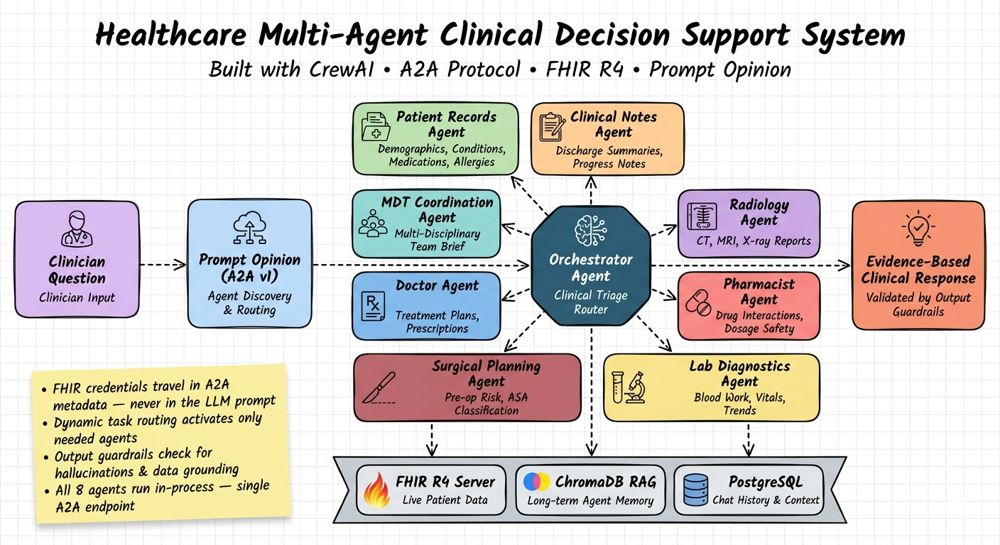

# Healthcare Multi-Agent Clinical Decision Support System

Built with **CrewAI**, the **A2A Protocol**, **FHIR R4**, and **Prompt Opinion**.

This project provides an AI-powered clinical decision support system that acts as a virtual attending physician. It queries live FHIR R4 patient data through a suite of specialist agents, synthesises findings, and provides evidence-based clinical reasoning — including differential diagnoses, treatment recommendations, risk stratification, and care plans.



## Overview

The system uses a hierarchical multi-agent architecture orchestrated by **CrewAI**. Instead of exposing multiple distinct microservices, this project exposes a **single A2A endpoint** (`orchestrator`). The orchestrator delegates clinical queries to internal specialist agents who run in-process, fetching FHIR data dynamically based on the context required to answer the user's question.

### The Agents

1. **Orchestrator Agent**: The central clinical triage router and synthesiser. It bridges the A2A API to the CrewAI execution flow.
2. **Patient Records Agent**: Retrieves demographics, conditions, medications, allergies, and care team information.
3. **Clinical Notes Agent**: Analyses clinical documents and discharge summaries.
4. **Radiology Agent**: Interprets X-ray, CT, MRI, and ultrasound reports.
5. **Pharmacist Agent**: Reviews medication safety, drug-drug interactions, and dosage appropriateness.
6. **Lab Diagnostics Agent**: Interprets lab results and vital signs, flagging abnormal values and noting trends.
7. **Surgical Planning Agent**: Assesses perioperative risk and ASA classification.
8. **Doctor Agent**: Acts as an attending physician, providing medication prescriptions and diagnostic test orders based on holistic patient context.
9. **MDT Coordination Agent**: Synthesises all specialist findings into a comprehensive Multi-Disciplinary Team brief.
10. **General Purpose Agent**: Handles broader healthcare requests like nutrition and exercise plans.

## Architecture

* **Prompt Opinion / A2A**: The user interacts with the system through Prompt Opinion, using the A2A Protocol (v1).
* **FHIR Credentials**: Passed via A2A metadata dynamically — never stored permanently or placed directly into LLM prompts.
* **Database**: Uses PostgreSQL (with pgvector) for chat history, task caching, and RAG storage.
* **LLM Orchestration**: CrewAI is used for intelligent delegation and multi-pass synthesis. Guardrails validate outputs before they are returned to the user.

## Running Locally

To run the full stack locally (including PostgreSQL and the Orchestrator), simply use Docker Compose:

```bash
# 1. Create your .env file and set your API keys

# 2. Build and start the services
docker-compose up --build
```

The orchestrator will listen on port `8003`. 
The A2A Agent Card is available at: `http://localhost:8003/.well-known/agent-card.json`.
